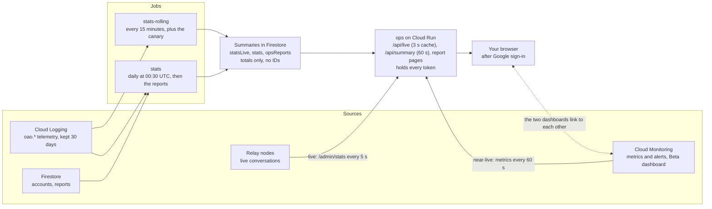

# Nowza Ops dashboard: implementation spec

Oct 2, 2026 · Steve Teixeira

This file is an export of the [Claude Doc](https://claude.ai/code/artifact/6f55879c-b785-4047-b937-fe4344c6904c) of the same name (rev 28). Edit the doc and re-export, or edit here and say which copy is current.

## Summary

We're building Nowza Ops: a product dashboard on Cloud Run that answers what's happening on the service and how people use it, with Google sign-in for a list of accounts Steve manages. It sits beside the existing Cloud Monitoring dashboard "Nowza Beta" (service graphs and alerts), and each links to the other. The design is the [Nowza Ops mockup](https://claude.ai/artifact/ALzAW7f1o2kmZGsZY6xzph); this spec says how to build it.

Decided with Steve on 2026-10-01:

| Question | Decision |
| --- | --- |
| Sign-in | Google accounts; Steve adds and removes them himself |
| Live anonymous conversation list | Allowed: device kinds, state, age and turn counts; no names, IDs or audio |
| Active (DAU, WAU, MAU) | Talked or listened to a friend; opening the app doesn't count; the Test Bot never counts |
| Speed targets (p50) | Watch tap → first audio 1.0 s, iPhone push → first audio 1.5 s, first press → go-ahead 0.5 s, watch in-app Answer → first audio 1.5 s, ring sent → ring shown 1.0 s |
| Missed targets | Shown on the page only; no alerts for now |
| Cloud Monitoring | Stays separate for service health and alerts; the two dashboards link to each other |
| Where the design lives | This spec, not the feasibility doc or HANDOFF.md (HANDOFF.md links here) |

Updated 2026-10-02 for Phase 0 of the [Android and Wear OS plan](ANDROID_WEAR_OS_PLAN.md), the v2 service contract deployed on 2026-10-01. Every device split now uses v2's client kind, form factor and push provider, so Android phones and Wear OS watches appear without dashboard changes. Operator routes moved to `/admin`, and the relay already knows each connection's device kind, so the session-token claim this spec first planned is dropped.

## Implementation status (2026-10-02)

Built on branch `ops-dashboard` as one pull request with a commit per milestone (A–E below), so it can still be split. Nothing is deployed or created on Google Cloud yet; "What needs Steve" is unchanged. This section is newer than the Claude Doc (rev 28).

Checked: server `npm test` 178 pass (33 skip without the emulator); the Firestore emulator suite 33 pass (with `count()`); the perf suite against `main` (3 quick rounds each, then full): 0 failures, 0 warnings, scenario B's press → grant 4.09 → 4.07 ms, the 200-pair load clean, and scenario C checks each record's `turns`. Locally end to end (a relay with the API and the in-process Test Bot on port 8191): watch ↔ iPhone back-and-forths (turns 3, then 5), iPhone → synthetic Android over the FCM stub (simulated, never accepted), a watch ringing the Test Bot (shown, marked), the Canary (passes, about 0.91 s to the bot's first frame), `rolling-main.ts`, `rollup-main.ts` with all ten reports, and `ops-main.ts` in a browser at desktop and phone widths. The simulators weren't used: no app changes.

Where the build differs from the text above:

- **Active** is enforced in `activeAccounts`: talked, or listened (answered, live, or replied), with a friend. Conversations with the Test Bot or the Canary don't count unless the page's Test Bot switch is on (the Canary's never), even without the bots' IDs, since records the bot answered are marked. Daily DAU from now on is lower than before for the same day (opening the app no longer counts).
- **Live list:** a conversation with the Test Bot is shown, marked "Test Bot", so the post-deploy check (ring the Test Bot, look at the live panel) works; the bot's and the Canary's connections, and the Canary's conversations, are left out as specified.
- **Client kinds on the record:** the relay logs a `memberKind` event the first time each member talks or joins, which the record turns into `fromClientKind`/`toClientKind` (the ring's target's kind when the other side never joined).
- **Tiers:** ring outcomes, push delivery, quality and safety counters come from the rolling job (15 minutes), with a near-live "last hour" line from Monitoring's `oao_conversations` and `oao_apns_failures`. The near-live tier is API latency, errors and instances, relay CPU, uptime checks, open incidents, Firestore and Logging usage.
- **Ranges:** 7 and 30 days add each day's `conversationStats` (in `stats/{date}` from now on); medians over a range are each day's, weighted by its count ("by day").
- **Regenerate** needs `roles/run.jobsExecutorWithOverrides` on the `stats` job (`run.invoker` can't pass arguments), and a custom request header against cross-site posts.
- **Page CSP:** scripts and style sheets only from the service (fonts from Google); style attributes are allowed, for bar and meter widths.
- **Accounts today** come from the rolling job (it already lists accounts for the provider split), not the daily snapshot plus sign-ups.
- **Monitoring:** the Canary's `oao_canary_first_frame_ms` and `oao_canary_failures` metrics and two charts; links go into every `Nowza:` and `Relay down:` policy's documentation.
- **Not built:** the Spend panel (no billing budget), the TestFlight feedback counts in the cloud (no App Store Connect key there), the e2-micro ceiling (not measured). Each says so on the page.

## Architecture

One new Cloud Run service, `ops`, gathers every number server-side and serves the page behind Google sign-in. It reads three things: the relay's live state, summaries the two stats jobs write to Firestore, and Cloud Monitoring's metrics.



The arrows into `ops` are the five freshness tiers from the mockup: live from the relay, near-live from Monitoring, and rolling, daily and reports from Firestore.

| Tier | Freshness | Comes from | Status |
| --- | --- | --- | --- |
| Live | 5 s, while the page is open | Relay `GET /admin/stats` | New |
| Near-live | About 1 minute | Cloud Monitoring: the `oao_*` log-based metrics, Cloud Run, Compute, Firestore and uptime metrics | Exists |
| Rolling | 15 minutes | `stats-rolling` → `statsLive/{date}` | New |
| Daily | 00:30 UTC | `stats` → `stats/{date}` | Exists |
| Report | Nightly, or on request | `stats` → `opsReports/{id}` | New |

## Android and Wear OS readiness

The dashboard is built on Phase 0's v2 vocabulary, so the Android phone beta (Phase 3) and the Wear OS beta (Phase 4) bring new data, not dashboard changes. Every device split uses these dimensions:

| Dimension | Values | Where the page splits by it |
| --- | --- | --- |
| Client kind | `ios`, `watchos`, `android`, `wearos` | Connected devices, answer rate, speed, crash-free conversations, builds, refused connections |
| Form factor | `phone`, `watch` | Rang on, Ring Me On, cross-platform conversations |
| Ecosystem pair | Apple–Apple, Apple–Android, Android–Android | Cross-platform conversations and its report |
| Push provider and mode | `apns/alert`, `apns/pushtotalk`, `fcm/notification`, `relay/foreground` | Push delivery, On the air now, the Ring delivery report |
| Sign-in provider | `apple`, `google` | Accounts, DAU, retention, the invite funnel |
| Codec | `opus16k`, `pcm16le16k` | Opus-less streams, codec refusals |

- **Labels:** the page says iPhone, Apple Watch, Android phone and Wear OS watch; stored data keeps the v2 names. Daily documents written before this work keep their `iphone` and `watch` labels (`platformLabel`), and the page reads both.
- **Zero, not hidden:** Android rows show 0 until their phase turns them on, so their arrival is visible. Production Google sign-in and FCM arrive in Phase 2, the phone beta in Phase 3 and the watch beta in Phase 4. Phase 1's prototypes run on staging, which this dashboard doesn't watch.
- **Simulated deliveries:** the FCM stub and dry runs never count as accepted or delivered. They appear only in the Ring delivery report, marked simulated, and should be 0 in production, where test-only auth and delivery are off.
- **Speed targets:** Android's receive flow is notification, then tap to listen, so its headline step is tap → first audio, as on the Apple Watch. Its targets come from Phase 1's measurements and join Summary's table then.
- **One ring, counted once:** a ring keeps its ID when it rolls over or falls back, so Rang on and answer rate count each ring ID once.

## Sign-in and access

Yes: Identity-Aware Proxy (IAP) puts Google sign-in in front of the `ops` service, and Steve adds any Google account, Gmail included, with one command. IAP directly on Cloud Run has been generally available since 2026-03-13, needs no load balancer and costs nothing beyond the service ([release notes](https://docs.cloud.google.com/run/docs/release-notes), [IAP for Cloud Run](https://docs.cloud.google.com/run/docs/securing/identity-aware-proxy-cloud-run)).

### Options compared

| Option | Cost | Code to write | Adding a person |
| --- | --- | --- | --- |
| **IAP on Cloud Run (recommended)** | $0 | None: requests reach `ops` only after Google sign-in | One `gcloud` command, or add them to a Google Group |
| IAP behind a load balancer | About $18 a month for the forwarding rule ([pricing](https://cloud.google.com/vpc/network-pricing)) | None | Same as above |
| Firebase Authentication, Google provider | $0 up to 50,000 monthly users ([pricing](https://firebase.google.com/pricing)) | Sign-in in the page, ID-token checks and an allowlist in `ops` | Edit the allowlist |

### Setup, once (Steve, in the console)

The project has no Google Cloud organization, so IAP can't use Google's managed OAuth client and the client can't be created from the command line ([custom OAuth](https://docs.cloud.google.com/iap/docs/custom-oauth-configuration)):

1. **OAuth consent screen:** user type External, app name "Nowza" (the app's name, not the dashboard's; see below), support email nowza@cypressoakstudios.com, privacy policy nowza.app/privacy, scopes only name, email and profile, no logo for now.
2. **Publishing status:** In production, so anyone Steve grants can sign in without also being a test user. With only the basic scopes this should need no Google verification; to confirm when Steve publishes it. If Google asks for verification, stay in Testing, which allows 100 test users, and add each person as a test user too.
3. **OAuth client:** a Web application client for IAP. `setup-ops.sh` then passes its ID and secret to IAP's settings.

A project has one OAuth consent screen, and Phase 2 of the Android plan will put the app's own Google sign-in in this project. So the screen is named for the app from the start, and the dashboard's IAP client is simply one OAuth client under it; Android's sign-in clients join it later. When Phase 2 publishes the app's sign-in, Google's brand verification (logo, domain, privacy policy) applies to the whole screen, and the dashboard keeps working through it.

Then `setup-ops.sh` deploys with `--no-allow-unauthenticated --iap` and grants the IAP service agent `roles/run.invoker` on the service, which Cloud Run checks since GA.

### Adding and removing people

Recommended: grant one Google Group, then manage people in Google Groups with no `gcloud` at all.

```
# once
gcloud iap web add-iam-policy-binding --member=group:overandout-ops@googlegroups.com \
  --role=roles/iap.httpsResourceAccessor --region=us-central1 --resource-type=cloud-run --service=ops

# or one person at a time: deploy/gcp/ops-access.sh add|remove|list <email>
gcloud iap web add-iam-policy-binding --member=user:helen@example.com \
  --role=roles/iap.httpsResourceAccessor --region=us-central1 --resource-type=cloud-run --service=ops
```

IAP sends `X-Goog-Authenticated-User-Email` with each request. `ops` writes it into its request log and shows "Signed in as" in the header; the header is trusted only because nothing reaches the service except through IAP.

### Address

The service's `run.app` address works with IAP as it stands. A friendlier `ops.nowza.app` would need a Cloud Run domain mapping (still preview) or a load balancer, so it waits; the page is bookmarked, not typed.

## Relay and telemetry changes

Phase 0 already gave the relay most of what the live panel needs: each connection declares its client kind at admission, and every ring carries a ring ID, the target's client kind and its push provider. What's left is one read-only route and back-and-forths on the conversation record. No app change is needed.

### Live state: `GET /admin/stats`

Since Phase 0 the operator's diagnostics live under `/admin` (`/admin/status`, `/admin/metrics`). The new route sits beside them and answers with totals and anonymous rows from the node's memory (`relay.ts`), computed on request:

```json
{
  "node": "relay-1", "revision": "828fda6", "startedAt": 1790800000000, "now": 1790886005000,
  "conversations": { "open": 23, "talking": 6, "ringing": 4, "waiting": 13 },
  "streams": { "ios": 177, "watchos": 141, "android": 0, "wearos": 0 },
  "pcmOnly": 0,
  "held": { "bursts": 9, "bytes": 421888 },
  "peaks": { "conversations": { "value": 61, "at": 1790822400000 }, "streams": { "value": 604, "at": 1790829000000 } },
  "live": [ { "state": "talking", "from": "watchos", "to": "ios", "ageMs": 42000, "turns": 5, "held": 0, "ring": "apns/pushtotalk", "rolledOver": false } ]
}
```

- **State:** talking = the floor is held; ringing = a ring is armed and unanswered, including the 12 s before a Roll Over to the phone; waiting = neither.
- **`streams`:** open connections by the client kind declared at admission (`Peer.clientKind`, which the relay checks against the session's stored kind). Android and Wear OS stay at 0 until the Phase 1 prototypes connect.
- **Bots:** connections from the Test Bot and Canary accounts are left out. Bots from `tools/client.ts` declare `watchos` by default and would otherwise count as Apple Watches.
- **`pcmOnly`:** streams that can't play Opus (their admitted decode list). Every Apple build plays both codecs, so this stays 0 until an Android build ships without Opus; it's the early sign of codec trouble.
- **`live`:** at most 50 rows, newest first, no conversation, ring or user IDs. `from` and `to` are client kinds; `ring` is the current ring's `provider/mode` (`apns/alert`, `apns/pushtotalk`, `fcm/notification`, `relay/foreground`) or absent.
- **Peaks** since midnight UTC, in memory, so a deploy or node replacement resets them. The rolling job keeps the day's true peak.
- **Auth:** `SPIKE_TOKEN` already guards `/admin`, but it also opens `/admin/status`, which lists user IDs. A new `ops-stats-token` opens only `/admin/stats`, and the ops service gets only that.
- **Several nodes (option E):** the ops service sums every node's answer; the node list comes from its `RELAY_NODES` setting.

New fields in `relay.ts`: `startedAt`, `turns` and `lastSpeaker` on `Conversation`, and two peak counters on `Relay`. The ring's delivery and `rolledOver` already exist.

### Back-and-forths on `oao.conversation`

`conversationRecord()` in `telemetry.ts` already receives every `talkStart` (`"<from> -> <to>"`) and `burstEnded` (`"<from> <n> ms"`) in order; v2 kept both formats, so the relay needs no new events. New fields:

| Field | Meaning |
| --- | --- |
| `turns` | Changes of speaker: A then B = 1, A, B, A = 2. A message with no reply = 0 |
| `replyGapsMs` | For each change of speaker, the end of one person's burst to the start of the other's reply; at most 50 |
| `durationMs` | First `talkStart` to `conversationEnded` |
| `fromClientKind`, `toClientKind` | Each side's client kind when it first talked or joined, for the cross-platform splits |

A reply that starts before the other burst ends records a gap of 0. Records written before the change lack these fields; reports treat them as unknown, not 0. Phase 0's ring fields (`ringId`, `ringClientKind`, `ringProvider`, `simulatedDelivery`) are already on the record and used as they are.

### Tests

- `relay.test.ts`: states, rows, peaks, bot exclusion and `pcmOnly` from fake peers of all four client kinds; the route refuses `SPIKE_TOKEN` and session tokens.
- `telemetry.test.ts`: `turns`, `replyGapsMs` and the client-kind fields for one-way, two-way and interleaved bursts.
- `v2.test.ts`: an Apple peer and a synthetic Android peer (the Google dev account and the FCM stub) show up as `ios` and `android` in `/admin/stats`.
- `perf/`: scenario B (back-and-forth) checks the record's `turns`.

## Rolling job

A Cloud Run job, `stats-rolling`, runs every 15 minutes and writes today-so-far numbers to one Firestore document. It reuses `stats.ts` and runs in the API's image as `account-api`, which already reads logs and Firestore, so it needs no new permissions.

### Each run

1. Read today's telemetry entries (00:00 UTC to now) from Cloud Logging with `readCloudLogging`: `oao.conversation`, `oao.device`, `oao.apns`, `oao.push` (FCM and simulated deliveries, kept apart from APNs since Phase 0), `oao.admission` (refused connections), `oao.event`, `oao.action`, `oao.registration`, `oao.feedback`, `oao.diagnostics`.
2. Compute `rollingStats(date, entries)`: activity as `activity()` does today, plus conversation depth, speed percentiles, ring outcomes and quality counters, each split by client kind where Metric definitions says so. Rings marked `simulatedDelivery` never count as delivered.
3. Read the relay's `/admin/stats` once and keep the larger of its peaks and the document's.
4. Run the canary (below).
5. Write `statsLive/{YYYY-MM-DD}`: the totals, plus a 96-slot array per headline measure (DAU so far, conversations so far) so the page can compare with yesterday at the same time. A 14-day TTL on `expireAt` removes old days.

WAU and MAU stay with the daily job: they need distinct accounts across days, and the documents hold totals only. Re-reading the whole day each run is simple and cheap at Beta volume; past about 100,000 entries a day, switch to the BigQuery option under Reports.

### Schedule

`setup-stats.sh` adds the job and a Cloud Scheduler job `stats-rolling` (`*/15 * * * *`, UTC), the same way it set up `stats-daily`. That's the account's third Scheduler job, the last free one; a fourth would cost about $0.10 a month.

### Canary

Each run, a dedicated Canary account talks to the always-on Test Bot over the live relay, with v2 admission headers (client kind `ios`), and times connect → hello-ack, talk-start → go-ahead, and talk-start → first frame of the bot's greeting. Since Phase 0 the relay checks stored sessions at admission and fails closed, so a signed token alone isn't enough: the Canary's session is created once with `tools/test-account.ts`, and each run mints a token for that session with `session-signing-key`, which `account-api` can already read. Results go to the document and to an `oao.canary` log entry, for a chart in Cloud Monitoring.

It checks admission, the session check, the friend lookup and the relay end to end. It doesn't check APNs or, later, FCM, because the Test Bot never rings a device; push numbers come from `oao.apns` and `oao.push`. The Canary account is excluded from all usage numbers and live counts, like the Test Bot.

### TestFlight feedback and crashes (optional)

The mockup shows TestFlight feedback and crash counts. Reading them in the cloud needs an App Store Connect API key there, and today's key is an Admin key on Steve's Mac. Option: Steve creates a separate key with the least role that reads TestFlight feedback, stored as the secret `asc-feedback-key`. Until then the page shows the counts `asc.ts` last wrote, when Steve runs it.

### Tests

- `stats.test.ts`: `rollingStats` over fixed entries; the 96-slot arrays; Canary and Test Bot excluded.
- Local run: `STATS_LOCAL_DIR=<DATA_DIR> node src/rolling-main.ts` against a local relay, as `rollup-main.ts` runs today.

## Ops service

A Cloud Run service, `ops`, serves the page and a small JSON API that gathers every number server-side, so no token ever reaches the browser. It runs the API's image with its own entry point, `node src/ops-main.ts`, and follows the server's rules: Node 24, TypeScript run directly, no dependencies.

### Routes

| Route | Returns | Server-side cache |
| --- | --- | --- |
| `GET /` | The page: `server/ops/index.html`, one CSS and one JS file, built from the mockup | none |
| `GET /api/live` | Every relay node's `/admin/stats`, summed; a node that doesn't answer in 2 s is marked down | 3 s |
| `GET /api/summary?range=today\|7d\|30d` | `statsLive/{today}`, the last 30 `stats/{date}` documents, and the near-live series from Cloud Monitoring | 60 s |
| `GET /api/reports` | Each report's name, when it was generated and its status | 60 s |
| `GET /reports/{id}` | A stored report, as a page | none |
| `POST /api/reports/{id}/run` | Starts the report job for one report; the page shows "Generating" until it lands | none |

The caches mean several people viewing at once cost the same as one.

### The page

- Polls `/api/live` every 5 s and `/api/summary` every 60 s, and stops both while the tab is hidden, so the service scales back to zero.
- Every section shows its freshness chip and the time its data was produced, not the time it was fetched. Data older than twice its tier's interval turns the chip amber.
- The range buttons change engagement and ring numbers only; the Test Bot switch is off by default.
- A missed speed target turns its row amber on the page, with no alert (decided 2026-10-01).
- The header links to the Cloud Monitoring dashboard (Linking, below).

### Service settings

- Minimum 0 and maximum 1 instance, 256 MiB, CPU only during requests.
- A new service account, `ops-viewer`: Firestore read (`roles/datastore.viewer`), `roles/monitoring.viewer`, access to the `ops-stats-token` secret, and `roles/run.invoker` on the report job.
- `deploy/gcp/setup-ops.sh` creates it; `deploy-api.sh` keeps its image current, as it does for the `stats` job.

### Local development

`OPS_LOCAL=1 STATS_LOCAL_DIR=<DATA_DIR> RELAY_NODES=http://localhost:8080 node src/ops-main.ts` serves the page against a local relay, with no sign-in and Cloud Monitoring panels showing sample series. This is how the page is checked before any deploy.

## Metric definitions

Every number on the page, where it comes from and how fresh it is. Usage numbers exclude the Test Bot and the Canary unless the page's Test Bot switch is on. "New" marks data this project doesn't collect yet. "By kind" means split by client kind (iPhone, Apple Watch, Android phone, Wear OS), shown as rows that read 0 until that kind exists.

| Section | Metric | Definition | Source | Tier |
| --- | --- | --- | --- | --- |
| Right now | Open conversations, by state | Conversations the relay holds: talking, ringing, waiting | `/admin/stats` (new) | Live |
| Right now | Connected devices, by kind | Open relay streams by admitted client kind; bots left out | `/admin/stats` (new) | Live |
| Right now | Opus-less streams | Streams that can't play Opus | `/admin/stats` `pcmOnly` (new) | Live |
| Right now | Messages held | Bursts kept for a member who hasn't heard them, and their bytes | `/admin/stats` (new) | Live |
| Right now | On the air now | Up to 50 anonymous rows: state, client kinds, age, turns, ring provider and mode, rolled over | `/admin/stats` (new) | Live |
| Right now | Relay health | `/healthz`, revision, uptime; node CPU and memory | Relay; Compute metrics | Live; near-live |
| Right now | API health | p95 latency, 5xx share, instances | Cloud Run metrics, `oao_api_errors` | Near-live |
| Right now | Uptime checks, alerts firing | The 2 uptime checks; open incidents of the alert policies | Cloud Monitoring | Near-live |
| Right now | Canary | Talk-start → Test Bot's first frame; passes today | `statsLive`, `oao.canary` (new) | Rolling |
| Engagement | DAU | Accounts that talked or listened to a friend that UTC day (`activeAccounts`); also by sign-in provider | `statsLive` today; `stats/{date}` before | Rolling |
| Engagement | WAU, MAU | The same over 7 and 30 days | `stats/{date}` | Daily |
| Engagement | DAU/MAU | Yesterday's DAU ÷ yesterday's MAU, and its 30-day average | `stats/{date}` | Daily |
| Engagement | Conversations | `oao.conversation` records, by outcome | `statsLive`, `stats/{date}` | Rolling |
| Engagement | Cross-platform conversations | Conversations by pair of form factors and of ecosystems (Apple–Apple, Apple–Android, Android–Android) | `fromClientKind`, `toClientKind` (new) | Rolling |
| Engagement | Back-and-forths | Mean, median and histogram of `turns` (0, 1, 2–3, 4–6, 7–12, 13+) | `oao.conversation.turns` (new) | Rolling |
| Engagement | Got a reply | Share of conversations with `turns` ≥ 1 | Same | Rolling |
| Engagement | Median reply gap | Median of every `replyGapsMs` value in range | `oao.conversation.replyGapsMs` (new) | Rolling |
| Engagement | Active pairs | Distinct friend pairs with a conversation; counted in the job, stored as a total | `oao.conversation` from and to | Rolling |
| Engagement | Talk time, median burst | Sum of both sides' talk; median burst length | `callerTalkMs`, `calleeTalkMs`, `burstEnded` | Rolling |
| Rings | Ring outcomes | Rings, push accepted, answered, rolled over, missed, declined, unavailable, push failed, refused | `oao.conversation` outcome and events (`ringRolledOver`, `declineReported`) | Near-live |
| Rings | Answer rate, by kind | Answered ÷ rings whose push was accepted, by `ringClientKind`; simulated deliveries excluded | Same, `simulatedDelivery` | Near-live |
| Rings | Push delivery, by provider | Accepted, permanently rejected, unknown or transient; send p50 and p95; failures by reason. APNs now, FCM from Phase 2 | `oao.apns`, `oao.push`, `oao_apns_failures` | Near-live |
| Rings | Rang on | Form factor of the first ring; share that rolled over or fell back to the other form factor | `ringClientKind`, `rings[]` | Rolling |
| Speed | Steps against targets, by kind | p50 and p95 of each step in Summary's target table; Android rows from Phase 1 | `oao.device` intervals; `oao_*_ms` metrics | Rolling |
| Quality | Crash-free conversations, by kind | Conversations without a crash or unclean exit on either device | `oao.device` problems, `oao.diagnostics` | Rolling |
| Quality | Problem counters | Unclean exits, streams dropped, PushToTalk join failed, audio never started, silent and clipped bursts, level drop, refresh failures | `oao.device` problems, `oao.levels`, `oao.event` | Near-live |
| Quality | Codec and protocol refusals | Bursts refused for a codec the listener can't play, undecodable bursts, joins refused | Relay `codecRefused`, `burstUndecodable`, `joinRefused` | Near-live |
| Quality | Connections refused, by kind and build | Admission errors: `client-upgrade-required` (below `MINIMUM_BUILDS`), `unsupported-protocol`, `client-kind-mismatch`, `session-ended`, session lookup unavailable | `oao.admission` | Near-live |
| Quality | Feedback | Report a Problem, TestFlight feedback, diagnostics pulls waiting | Firestore `feedback`, `diagnostics`; App Store Connect (optional) | Rolling |
| Growth | Accounts, by sign-in provider | Accounts by `identity.provider` (Apple; Google from Phase 2) | `stats/{date}` usage snapshot (new split) | Daily |
| Growth | Sign-ups, invites, activation | As `usageSnapshot()` and `activity()` define them today; sign-ups today from `oao.registration` | `stats/{date}`; `oao.registration` | Daily; near-live |
| Growth | Devices | Accounts by the kinds they have registered (iPhone, watch, both, and Android combinations by name) | `usageSnapshot().devices` | Daily |
| Growth | Reachability | Accounts with no device that can be rung, devices with notifications denied or availability off | v2 device `delivery` and `availability` (new split) | Daily |
| Growth | Ring settings | Ring Me On (`preferredFormFactor`: watch, phone, automatic), Roll Over on, iPhones in PushToTalk | `usageSnapshot()` (Roll Over is a new count) | Daily |
| Growth | Builds, by kind | Share of active devices on the newest build of each client kind, and on builds below the minimum | `oao.device` build and client kind (new rollup field) | Rolling |
| Data | Firestore by collection | Document count per collection (`count()` queries, 1 read per 1,000 docs) | Nightly storage audit | Daily |
| Data | Firestore total size | `firestore.googleapis.com/storage/data_and_index_storage_bytes` | Cloud Monitoring | Near-live |
| Data | Free-tier headroom | Firestore reads and writes today; logging this month; relay disk; Scheduler jobs | Cloud Monitoring; fixed limits | Near-live |
| Data | Spend | Month to date and forecast against the budget | Cloud Billing budget (see Privacy, security and cost) | Daily |
| Data | Relay capacity | Peak streams today against an estimated e2-micro ceiling, nodes | `/admin/stats` peaks; perf suite | Live |
| Safety | Open reports | Unresolved `reports`, and the oldest one's age against 24 h | Firestore `reports` | Rolling |
| Safety | Counters | Reports, blocks, names refused, photo reports, deletions, rings refused | Firestore `reports` and `blocks` (collection-group count); `oao.api` error `name-not-allowed`; relay `ringRefused`; deletions need a new API telemetry entry | Rolling |

The e2-micro ceiling is a placeholder until the perf suite measures it: scenario H at 200 pairs is the closest run so far. The Reachability row comes from the registration gap after Steve's sign-in on 2026-10-02 (neither device registered for rings): an account that can't be rung looks fine everywhere else on the page.

## Reports

Reports are rendered nightly by the existing `stats` job, right after its 00:30 UTC rollup, so they need no new Scheduler job. Each is stored as a finished page in Firestore and can be regenerated from the dashboard.

### How they run

- `node src/reports-main.ts [id ...]` renders one report, or all of them. `rollup-main.ts` calls it after writing `stats/{date}`.
- The page's Regenerate button starts the `stats` job with the report's ID as an argument override.
- Each report is stored at `opsReports/{id}` (HTML under 1 MiB, inputs' time range, generated at) and the last 30 copies at `opsReports/{id}/history/{date}` with a TTL. The name avoids the existing `reports` collection, which holds user abuse reports.
- Pages are plain HTML with inline SVG charts, styled like the dashboard, totals only.

### The ten reports

| Report | Question it answers | Inputs |
| --- | --- | --- |
| Retention cohorts | Of the people who signed up in a week, how many came back on day 1, 7 and 30? Split by sign-in provider and by the devices they use | `users.createdAt`, `identity.provider` and each day's active accounts; stored as cohort × day totals |
| Conversation depth | Who has longer conversations: which device pairs, hours, friend tenure? | `turns`, `replyGapsMs`, the client-kind fields; friend tenure from `friends.since` |
| Cross-platform conversations | Do Apple–Android conversations go as well as Apple–Apple ones? | Outcomes, turns, answer rate and speed by ecosystem pair; codec refusals and `pcmOnly` peaks |
| Speed by build | Did a build make any step slower? | `oao.device` intervals by client kind and build; flags p50 worse than that kind's previous build by 10% or 100 ms |
| Ring delivery | Why are rings missed or failing? | `oao.apns` and `oao.push` by provider and reason, outcomes by Ring Me On, Roll Over and hour, stale tokens removed; simulated deliveries listed apart |
| Invite and activation funnel | Where do new people drop off? | Invite created → accepted → first conversation → active on day 7, by week and sign-in provider |
| Audio quality | Are some microphones or routes too quiet or clipping? | `oao.device` levels by client kind and mic port, `oao.levels`, engine restarts |
| Cost and quotas | What will this cost at 2× and 10× the users, and when is a second relay node due? | Billing export or budget, Firestore and Logging usage, peak streams |
| Storage audit | What's growing, and is anything orphaned? | `count()` per collection, TTL backlog, push tokens without a device, companion sessions without their parent, photos without an account |
| When people talk | Which hours are quiet enough for deploys and node replacement? | Conversations by UTC hour and weekday |

### Retention without keeping logs longer

Cloud Logging keeps entries for 30 days, and the stats documents hold totals only. So the retention report never looks back further than that: each night it finds the cohorts reaching day 1, 7 or 30 today, counts how many of those accounts were active today, and stores only those totals. After 30 nights the report has a full table.

Anything needing per-account history beyond 30 days would need a longer log retention or a BigQuery sink. Both are cheap at this volume, but both keep per-account telemetry longer than the privacy policy now describes, so neither is in this plan.

## Linking with Cloud Monitoring

The two dashboards link to each other, and alert emails link to both. Cloud Monitoring stays the place for raw service graphs and alerting; Nowza Ops is for the product questions.

| From | To | How |
| --- | --- | --- |
| "Nowza Beta" dashboard | Nowza Ops | A Text widget across the top, `{"text": {"content": "[Open Nowza Ops](…)", "format": "MARKDOWN"}}` ([widget reference](https://docs.cloud.google.com/monitoring/api/ref_v3/rest/v1/projects.dashboards)), added in `telemetry-monitoring.ts` from a new `OPS_URL` in `config.sh` |
| Nowza Ops header | "Nowza Beta" dashboard | A "Service graphs" link |
| Ops "Service health" card | Monitoring's incidents and uptime checks | "Alerts" and "Uptime checks" links next to those rows |
| The 7 alert policies | Both dashboards | Each policy's documentation (Markdown, included in the alert email) gets the two links |

`telemetry-monitoring.ts validate` checks the new widget like the rest, and `apply` updates the dashboard in place. The dashboard keeps its name; renaming it "Nowza Service" would make the split clearer, if Steve wants that.

Since Phase 0 the relay logs FCM and simulated deliveries as `oao.push`, never `oao.apns`, so the existing APNs alerts and charts stay APNs-only. An FCM alert policy and chart in `telemetry-monitoring.ts` belong to Phase 2, when FCM goes live.

## Privacy, security and cost

The dashboard stays inside what the privacy policy already says, and its running cost is a few cents a month.

### Privacy

- **Stored:** only totals, as the policy promises ("daily totals … with no account IDs, names or audio"). `statsLive`, `stats` and `opsReports` hold no account IDs.
- **Shown live:** the anonymous rows from relay memory, never stored. Steve approved them on 2026-10-01.
- **Read:** the jobs read the same 30-day telemetry the policy describes, which is deleted after 30 days. Nothing here keeps it longer.
- **Small numbers:** while the Beta is small, a total of 1 or 2 can point to a person. The page is for a few named Google accounts only, and reports aren't shared outside them.

Sign-in providers appear only as totals (accounts, active accounts and cohorts by Apple or Google). The provider's subject stays in `identities` and never reaches the page or the summaries.

### Security

- Nothing reaches `ops` without Google sign-in through IAP, and only granted accounts pass.
- `ops-viewer` can read Firestore and Monitoring but not write, and can start only the `stats` job.
- The relay's `ops-stats-token` opens only `/admin/stats`, which returns no IDs. The browser never sees it.
- `ops` logs who viewed what (the IAP user header) to its Cloud Run log.

### Cost

| Item | Monthly cost |
| --- | --- |
| `ops` on Cloud Run, scaled to zero, used a few hours a day | About $0 (within the free tier) |
| IAP on Cloud Run | $0 |
| `stats-rolling` Scheduler job | $0: the third of three free jobs |
| `stats-rolling` runs: 96 a day, under 30 s each | About $0 (within the free tier) |
| Firestore: 96 document writes a day, reads by the page, nightly `count()` queries | Well inside 50,000 reads and 20,000 writes a day |
| `ops-stats-token` secret | About $0.06 once active secret versions pass the 6 free ones |
| Cloud Monitoring API reads by the page, cached for 60 s | To confirm; expected $0 at this volume |

A Cloud Billing budget of $25 a month with email alerts would back the Spend panel. It's free, but it's a billing-account change, so it's Steve's call.

## Milestones and PRs

Five pull requests, each independent enough to review and deploy alone. Nothing touches the apps, so no TestFlight build is needed. The page can be built against a local relay before anything is deployed.

| PR | What it contains | Depends on | Deploy, each with Steve's OK |
| --- | --- | --- | --- |
| A. Relay and telemetry | `/admin/stats`, `turns`, `replyGapsMs`, `durationMs`, the client-kind fields, their tests | — | Relay only (about 2 minutes without it); the `ops-stats-token` secret |
| B. Rolling job and canary | `rolling-main.ts`, `rollingStats`, the 96-slot arrays, the usage snapshot's new splits (sign-in provider, reachability, Roll Over), the Canary, `setup-stats.sh` additions | A, for turns and device kinds | API image, the `stats-rolling` job and Scheduler job, the Canary account in Firestore |
| C. Ops service and page | `ops-main.ts`, `server/ops/` page, local mode, `setup-ops.sh`, `ops-access.sh` | A and B for live data; built locally first | The `ops` service with IAP, after Steve's console setup |
| D. Linking | The Text widget and alert-policy links in `telemetry-monitoring.ts`, `OPS_URL` | C, for its address | `telemetry-monitoring.ts apply` |
| E. Reports | `reports-main.ts`, the ten reports, the Regenerate route | B | API image |

### Testing

- **Server tests** for every new function, as listed in each section; `npm test` and the Firestore-emulator suite stay green.
- **Relay performance:** PR A runs the perf suite against `main`. The new counters sit on the talk-start path, so scenario B and the 200-pair load must show no change.
- **Local end to end** (HANDOFF's simulator setup): a local relay with the API, two bots talking back and forth, then `rolling-main.ts` and `ops-main.ts` against it. The page should show the right states, turns and gaps, and the watch and iPhone simulators should appear under the right device kinds.
- **On the live service:** after each deploy, ring the Test Bot from Steve's watch and iPhone and check the live panel and the next rolling numbers.
- No re-measure of tap → first audio is needed, since the apps don't change. PR A's perf run covers the relay.

**Android rows before Android exists:** the local end-to-end run adds a synthetic Android peer (the Google dev account and the FCM stub, as Phase 0's simulator runs did), so every by-kind panel shows a non-zero Android row and simulated deliveries show as simulated, never delivered. The live service has no Android traffic until Phase 2.

### What needs Steve

- [ ] OAuth consent screen and IAP OAuth client in the console (Sign-in and access)
- [ ] Decide: Google Group or per-person grants
- [ ] OK to create `ops-stats-token`, the `stats-rolling` Scheduler job, the Canary account and the `ops` service
- [ ] Each deploy: relay, API, ops, dashboard
- [ ] Optional: a Billing budget for the Spend panel
- [ ] Optional: an App Store Connect key for TestFlight feedback in the cloud
- [ ] Optional: rename the Monitoring dashboard "Nowza Service"

### Open questions

- Is a production-status consent screen with only basic scopes free of verification? Find out when Steve publishes it; fall back to Testing with test users.
- The e2-micro stream ceiling: measure with the perf suite before the capacity panel shows a number.
- Cloud Monitoring API read pricing at the page's volume: confirm before PR C ships.
